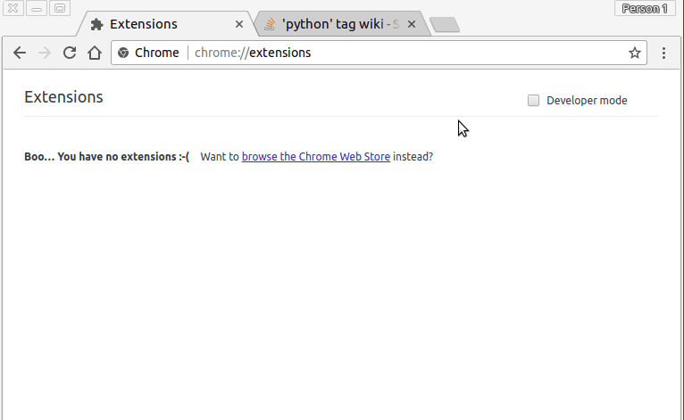

# chrome-compare 
This chrome extension can be used to compare the same page across multiple sites in new tabs.  
For example, it could be configured to open the production, staging, and local dev version of a site.  



### Requirements
1. urls in extension/config.js/base_urls must all use the same url structure in order for the links to load correctly.  

### Setup
1. Copy extension/config.js.EXAMPLE to extension/config.js and customize base_urls as necessary  
    ```cp extension/config.js.EXAMPLE extension/config.js```
1. Go to ```chrome://extensions/```  
1. Click the developer mode checkbox  
1. Click load unpacked extension and select the extension folder in this repo

### Usage
1. Click the icon.  
1. If the url contains any of the base_urls in config.js, you'll recieve a confirm popup.  
1. If you click ok, each url in base_urls (with the page you're currently on appended to them) will open in a new tab.

#### Example
1. Follow [The Setup](#setup) and use config.js.example
1. Open google chrome and visit ```https://datascience.stackexchange.com/questions/tagged/python```
1. Click the chrome extension icon.
1. Click ok on the confim popup.
1. stackoverflow, askubuntu, and datascience.stackexchange should all open with questions tagged python. 

Since all of these sites are part of the stackexchange group, most urls follow the same structure and can be opened in all three sites.

### Credit
Based on [this tutorial](https://robots.thoughtbot.com/how-to-make-a-chrome-extension#load-your-extension-into-chrome)  
Screen to gif software: [Peek](https://github.com/phw/peek)  
