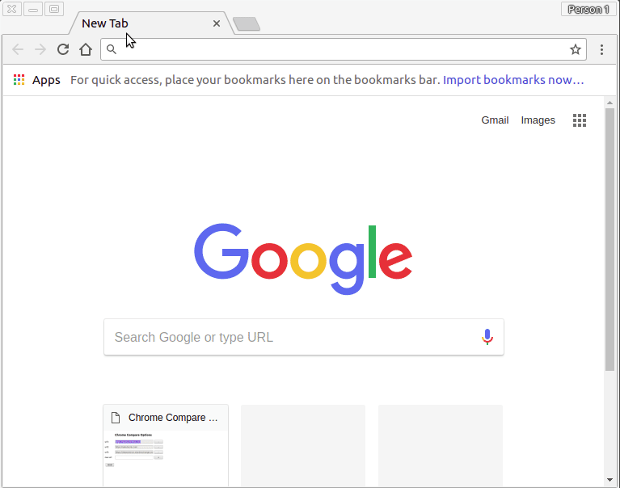

# chrome-compare 

[](https://travis-ci.org/ConorSheehan1/chrome-compare)
[](ConorSheehan1/chrome-compare/issues)

This chrome extension can be used to compare the same page across multiple sites.  
For example, it could be configured to open the production, staging, and development version of a site.  

### Setup
1. Go to ```chrome://extensions/```  
1. Click the developer mode checkbox.  
1. Click load unpacked extension and select the extension folder in this repo.


### Usage
1. Click the extension icon.
1. If the url contains any of the base_urls you've set in the options page, you'll recieve a confirm popup.  
    Otherwise you'll recieve a "no match" alert.
1. If you click ok, each url in base_urls (with the page you're currently on appended to them) will open in a new tab.


### Options
1. Right click on the extension icon.
1. Click options.
1. Pess the + button to add urls.
1. Press the - button to remove urls.
1. Press the reset button to set the urls back to what they were when you first installed the extension


### Tests
1. Install [jasmine](https://github.com/jasmine/jasmine)
1. Run ```jasmine```

### Credit
Based on [this chrome extension tutorial](https://robots.thoughtbot.com/how-to-make-a-chrome-extension#load-your-extension-into-chrome)
and [this options page tutorial](https://www.youtube.com/watch?v=d4RPNh_m8gc)  
Screen to gif software: [Peek](https://github.com/phw/peek)  
